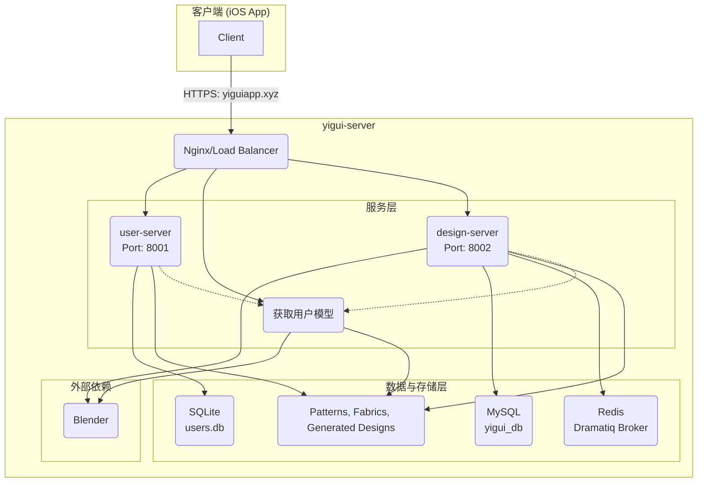

# Yigui-Server 服务端深度分析 (READMEforGemini2.md)

## 1. 简介

本文档旨在深度剖析 `yigui-server` 的整体架构、服务模块、核心功能及数据流。服务器采用微服务架构，由三个核心服务、两个数据库和一个消息队列（待启用）组成，共同支撑起用户管理、3D 人体模型生成和服装设计与渲染的全部后端功能。

**技术栈核心:**
- **后端语言:** Python 3
- **Web 框架:** FastAPI
- **数据库:** SQLite (用户服务), MySQL (设计服务)
- **3D 处理:** Blender
- **任务队列:** FastAPI BackgroundTasks (当前), Dramatiq with Redis (未来规划)
- **部署:** Uvicorn

## 2. 系统架构

系统整体架构遵循关注点分离原则，将不同业务逻辑拆分到独立的服务中，通过 RESTful API 进行通信。


**架构特点:**
- **`user-server`**: 负责用户认证（注册、登录）、用户信息管理和头像存储。
- **`model-server`**: 负责根据用户的身高、体重等参数，调用 Blender 生成个性化的 3D 人体模型。
- **`design-server`**: 核心业务服务，处理服装设计流程，包括样板管理、材质应用，并调用 Blender 将服装"穿"在人体模型上，最终渲染出 3D 服装模型。
- **数据库分离**: `user-server` 使用轻量级的 SQLite 满足基本用户信息存储需求，而 `design-server` 使用功能更完备的 MySQL 来处理复杂的设计项目和任务数据。
- **异步任务处理**: `design-server` 中耗时的 3D 渲染操作通过后台任务完成，避免阻塞 API 请求，客户端通过轮询任务状态接口来获取最终结果。

## 3. 服务详解

### 3.1 `user-server` (/root/user-server)

- **功能**: 提供完整的用户生命周期管理，包括注册、登录、信息修改和认证。
- **启动命令**: `uvicorn auth_api:app --port 8001`
- **关键技术**: FastAPI, SQLAlchemy, SQLite

#### 文件与目录结构
- **`auth_api.py`**: **[核心]** 服务主文件。定义了所有 FastAPI 路由和 API 逻辑。
- **`db.py`**: 数据库配置文件。定义了 SQLAlchemy 引擎、数据库模型（User, Avatar）和获取数据库会话的函数 (`get_db`)。
- **`users.db`**: **[数据]** SQLite 数据库文件，存储所有用户相关信息。
- **`email_utils.py`**: 邮件发送工具。封装了 `smtplib`，用于发送注册验证码。
- **`avatars/`**: **[静态资源]** FastAPI 配置的静态文件目录，用于提供头像访问。
    - **注意**: 代码中存在存储逻辑不一致的问题。头像上传后实际保存在了硬编码的 `/var/www/avatars/{nickname}_avatar` 目录，而 FastAPI 静态服务指向的是本项目下的 `avatars/` 目录。这可能需要 Nginx 额外配置别名或修复代码。
- **`log.txt`**: 运行时日志文件。

#### API 端点
- `POST /register`: 注册新用户，发送验证邮件，并在 `model-server` 中创建用户模型目录。
- `POST /verify`: 校验邮箱验证码。
- `POST /login`: 用户登录，返回 JWT。Token 中包含 `user_id`, `email`, `nickname`, `gender`。
- `GET /user_info`: 获取当前登录用户的详细信息。
- `POST /update_user_info`: 更新用户信息，如身高、体重、头像。更新昵称或性别会返回新的 JWT。
- `GET /avatars/...`: 静态文件服务，提供用户头像访问。

### 3.2 `model-server` (/root/model-server)

- **功能**: 根据用户参数，调用 Blender 生成标准化的 3D 人体模型。
- **启动命令**: `uvicorn main:app --port 8000`
- **关键技术**: FastAPI, Blender

#### 文件与目录结构
- **`main.py`**: **[核心]** 服务主文件，定义了 `/generate` API 路由。
- **`model_utils.py`**: **[核心逻辑]** 封装了模型生成的完整流程，包括选择基础模型、构造 Blender 命令和调用子进程。
- **`scale_model.py`**: **[Blender脚本]** 由 Blender 执行的 Python 脚本，负责接收参数并对 3D 模型进行实际的缩放操作。
- **`base_models/`**: **[资源]** 存放基础 3D 人体模型（如 `male.glb`, `female.glb`），作为后续个性化调整的模板。
- **`generated_models/`**: **[数据输出]** 所有生成成功的模型都存放于此，并按用户昵称分子目录（如 `{nickname}_models/`）进行组织。
- **`mlmodels/`**: **[预留/未使用]** 存放了 CoreML 格式的机器学习模型（如 `Chest_Ratio.mlmodel`），但当前后端代码未发现对这些模型的使用。
- **`clear_generated_models.py`**: 一个独立的维护脚本，用于清理生成的模型文件。
- **`log.txt`**: 运行时日志文件。

#### API 端点
- `POST /generate`: 核心接口，接收 `gender`, `height`, `weight`, `nickname` 等参数。
- `GET /models/...`: 静态文件服务，将 `generated_models/` 目录暴露出去，提供生成的 3D 模型下载。

### 3.3 `design-server` (/root/design-server)

- **功能**: 最核心的业务服务，负责服装的个性化设计、管理和异步渲染生成。
- **启动命令**: `uvicorn design_api:app --port 8002` (通常在 venv 环境下)
- **关键技术**: FastAPI, SQLAlchemy, MySQL, Blender, FastAPI BackgroundTasks

#### 文件与目录结构
- **`design_api.py`**: **[核心]** 服务主文件。负责创建 FastAPI 应用、配置 CORS 中间件、挂载路由和静态文件目录。
- **`design_api_routes.py`**: **[核心]** API 路由定义文件。包含了所有与设计项目、样板库和任务状态相关的 API 端点。
- **`task_processor.py`**: **[核心逻辑]** 后台任务处理器。定义了 `process_design_generation` 等函数，负责执行耗时的 Blender 渲染任务。
- **`db.py`**: 数据库配置文件，定义了连接到 MySQL 的 SQLAlchemy 引擎和模型。
- **`requirements.txt`**: Python 依赖包列表，明确了该服务所需的所有库。
- **`venv/`**: 该服务的 Python 独立虚拟环境。
- **`blender_scripts/`**: **[Blender脚本]** 存放所有由 Blender 执行的 Python 脚本，例如 `design_drape_simple.py` 用于实现服装的穿戴和渲染。
- **`pattern_lib/`**: **[资源]** 存放服装的 2D 样板文件（主要是 `.dxf` 格式）和对应的缩略图。
- **`fabrics/`**: **[资源]** 存放布料的纹理贴图图片。
- **`generated_designs/`**: **[数据输出]** 存放最终渲染生成的服装模型（`.glb` 文件），按用户昵称分子目录存放。
- **`auth_middleware.py`**: JWT 认证中间件，用于保护需要用户登录才能访问的 API。
- **`server.log`, `log.txt`**: 运行时日志文件。

#### API 端点 (前缀: `/api/v1/design`)
- **项目管理**:
    - `POST /projects`: 创建设计项目。
    - `GET /projects`: 获取用户的所有项目。
    - `GET /projects/{project_id}`: 获取项目详情。
    - `DELETE /projects/{project_id}`: 删除项目。
- **样板库**:
    - `GET /patterns`: 获取可用的服装样板。
    - `GET /patterns/categories`: 获取样板分类。
- **设计流程**:
    - `POST /projects/{project_id}/apply-pattern`: 将样板、材质、颜色等应用到项目中（仅记录关系）。
    - `POST /projects/{project_id}/generate-preview`: **(异步)** 触发 3D 模型生成任务，立即返回一个 `task_id`。
- **任务状态**:
    - `GET /tasks/{task_id}`: 客户端通过此接口轮询任务状态。
- **静态资源**:
    - `/designs/...`, `/patterns/...`, `/fabrics/...`: 提供设计成品、样板和材质的静态访问。

## 4. 数据库设计

服务器使用了两种数据库。

### 4.1 SQLite (`user-server`)

位于 `/root/user-server/users.db`。结构简单，主要存储用户认证和基础信息。

**`users` 表 (部分字段)**
- `id` (PK)
- `email` (UNIQUE)
- `password`
- `nickname` (UNIQUE)
- `gender`
- `height`, `weight`
- `avatar_url`
- `verification_code`, `verified`

### 4.2 MySQL (`design-server`)

数据库名 `yigui`。以下表结构根据 `design_api_routes.py` 和 `task_processor.py` 中的代码逻辑推断，`schema_backup.sql` 文件不完整。

**`DesignProject` 表 (设计项目)**
- `id` (PK)
- `user_id` (FK, 关联 `users` 表)
- `project_name`
- `model_id` (关联的人体模型)
- `status` (e.g., "draft", "generating", "completed", "failed")
- `uuid_filename`, `glb_url`, `thumbnail_url`
- `task_id` (关联 `TaskStatus`)
- `created_at`, `updated_at`

**`Pattern` 表 (样板库)**
- `id` (PK)
- `name`, `category`, `description`
- `dxf_path` (2D 样板文件路径)
- `thumbnail_path`
- `is_system` (是否为系统预置)

**`DesignPattern` 表 (项目-样板关联表)**
- `id` (PK)
- `design_id` (FK, `DesignProject.id`)
- `pattern_id` (FK, `Pattern.id`)
- `fabric_texture`
- `color_hex`
- `position_data` (JSON, 存储位置信息)

**`TaskStatus` 表 (任务状态)**
- `id` (PK)
- `task_id` (UUID, UNIQUE)
- `user_id`
- `task_type` (e.g., "design_generate")
- `status` (e.g., "pending", "processing", "completed", "failed")
- `progress` (0-100)
- `result_url`
- `error_message`
- `created_at`, `updated_at`

## 5. 核心外部依赖

- **Blender**: 用于所有 3D 模型生成和处理的核心软件。`model-server` 和 `design-server` 都通过命令行 (`subprocess`) 调用 Blender 执行 Python 脚本。
- **Redis**: 虽然当前未在 `design-server` 的任务处理中激活，但已作为依赖项安装，是未来扩展为 `Dramatiq` 任务队列的 Broker。

## 6. 运维说明

服务管理通过 `/root/manage_services.sh` 脚本进行。

- **启动服务**:
  ```bash
  ./manage_services.sh start
  ```
  该命令会启动 `model-server` 和 `user-server`。
  **注意**: `design-server` 当前需要独立启动:
  ```bash
  cd /root/design-server
  source venv/bin/activate
  uvicorn design_api:app --host 0.0.0.0 --port 8002 &
  ```

- **停止服务**:
  ```bash
  ./manage_services.sh stop
  ```

- **重启服务**:
  ```bash
  ./manage_services.sh restart
  ```

- **查看状态**:
  ```bash
  ./manage_services.sh status
  ```

**日志文件**:
- `user-server`: `/root/user-server/log.txt`
- `model-server`: `/root/model-server/log.txt`
- `design-server`: `/root/design-server/server.log` (或 `log.txt`) 