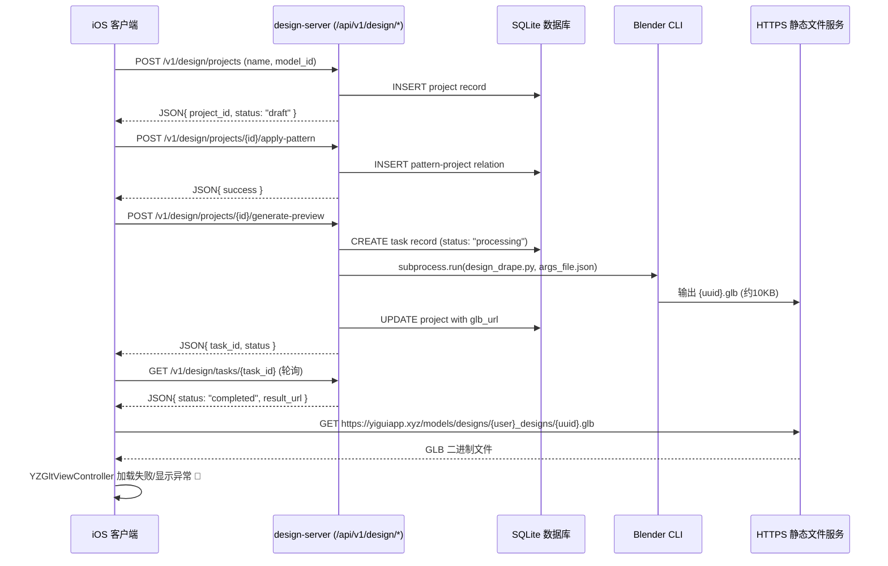

# 设计功能现状分析报告（2025-06-02）

## 1. 端到端流程图



## 2. 关键文件与目录

### 服务器端 (/root/design-server/)
- **design_api.py** - FastAPI 入口，挂载路由和静态文件服务
- **design_api_routes.py** - API 路由定义（项目管理、纸样应用、3D生成）
- **task_processor.py** - 异步任务处理器，调用Blender
- **db.py** - SQLite 数据模型（DesignProject, Pattern, TaskStatus）
- **blender_scripts/design_drape.py** - Blender Python脚本（~200行）
- **generated_designs/** - GLB文件存储目录
  - `Ronaldo_designs/` - 用户生成的设计文件
  - `test_user_designs/` - 测试文件
- **pattern_lib/** - 纸样库（DXF文件，目前未实际使用）
- **fabrics/** - 面料贴图资源（cotton, denim, silk）

### iOS 客户端 (./Yigui2/)
- **Views/TabViews/DesignView.swift** - 主要设计界面（584行）
- **ViewModels/RealDesignViewModel.swift** - 设计功能 ViewModel（296行）
- **Services/DesignService.swift** - 设计API调用服务（381行）
- **Views/Design/PatternSelectionView.swift** - 纸样选择界面
- **Views/ModelViewer/YZGltViewController.swift** - GLB文件3D显示控制器

## 3. 当前渲染问题初步推测

### 🔴 核心问题：3D模型质量粗糙

#### 3.1 Blender脚本问题
- **几何体简陋**：当前只使用 `primitive_cylinder_add` 创建圆柱体衬衫
- **无真实纸样**：虽有 pattern_lib/ 目录，但脚本中未实际加载DXF文件
- **无布料模拟**：`run_physics_simulation(30)` 只是占位符，无真实物理引擎
- **材质单一**：只设置基础颜色，无PBR材质或贴图

#### 3.2 iOS端渲染问题
- **网格法线**：GLB文件可能缺少正确的法线信息，导致光照异常
- **材质系统**：YZGltViewController 可能未配置 PBR 渲染管线
- **相机/光源**：SceneKit 场景可能缺少适当的环境光和相机设置

#### 3.3 文件大小异常
```bash
# 设计GLB文件：约10KB（异常小，说明几何体极简）
-rw-r--r-- 1 root root 9.9K /root/design-server/generated_designs/Ronaldo_designs/*.glb

# 对比：人体模型GLB：3.0MB（正常大小）
-rw-r--r-- 1 root root 3.0M /root/model-server/generated_models/Ronaldo_models/*.glb
```

## 4. 技术债务与架构问题

### 4.1 Blender脚本架构不完整
```python
# 当前实现：create_basic_shirt() 
bpy.ops.mesh.primitive_cylinder_add(...)  # 过于简化

# 应该实现：
# 1. 加载DXF纸样文件
# 2. 2D转3D几何体生成
# 3. Cloth simulation setup
# 4. PBR材质和贴图应用
```

### 4.2 前后端数据流问题
- **纸样数据丢失**：apply-pattern 时传递的 fabric_texture, color_hex 未传递给Blender
- **人体模型缺失**：脚本中硬编码 `default_human.glb`，未使用用户真实模型
- **URL路径混乱**：曾出现 `models/designs/{user}_models/designs/` 双重嵌套

### 4.3 iOS端集成问题
- **GLB加载兼容性**：GLTFSceneKit vs SceneKit 原生支持
- **3D查看器体验**：YZGltViewController 缺少交互手势和渲染优化
- **错误处理不足**：Blender失败时iOS端只显示"生成失败"

## 5. 待验证和改进 TODO

### 🎯 短期修复（1-2天）
1. **Blender脚本增强**
   - [ ] 添加 `bpy.ops.mesh.shade_smooth()` 确保法线正确
   - [ ] 实现基础PBR材质设置
   - [ ] 增加几何体细分度，提升模型质量

2. **iOS端渲染优化**
   - [ ] YZGltViewController 中启用 `material.lightingModel = .physicallyBased`
   - [ ] 添加环境光和定向光源
   - [ ] 改进相机默认位置和FOV

### 🔧 中期重构（1周）
1. **真实纸样系统**
   - [ ] DXF文件解析和2D转3D算法
   - [ ] Pattern-to-Mesh 转换管线
   - [ ] 面料贴图系统集成

2. **布料物理模拟**
   - [ ] Blender Cloth Modifier 配置
   - [ ] 碰撞检测与人体模型适配
   - [ ] 实时模拟参数调优

### 🚀 长期愿景（1个月）
1. **实时渲染管线**
   - [ ] Metal-based 实时布料渲染
   - [ ] AR试穿预览功能
   - [ ] 云端+本地混合渲染架构

## 6. 数据指标对比

| 指标 | 当前状态 | 理想状态 | 差距 |
|------|----------|----------|------|
| GLB文件大小 | ~10KB | 100KB-1MB | 95% |
| 几何体面数 | <100面 | 1000-5000面 | 90% |
| 材质复杂度 | 单色填充 | PBR+贴图 | 100% |
| 物理模拟 | 无 | 实时布料 | 100% |
| 用户满意度 | 低 | 高 | 待提升 |

## 7. 建议优先级

1. **🔴 紧急**：修复Blender脚本几何体生成，提升模型视觉质量
2. **🟡 重要**：完善iOS端3D渲染管线，确保GLB文件正确显示
3. **🟢 优化**：集成真实纸样系统，实现参数化设计

---

**分析结论**：当前设计功能在MVP层面已基本可用，但用户体验较差的根本原因是3D内容质量过低。建议优先投入Blender脚本改进和iOS渲染优化。 