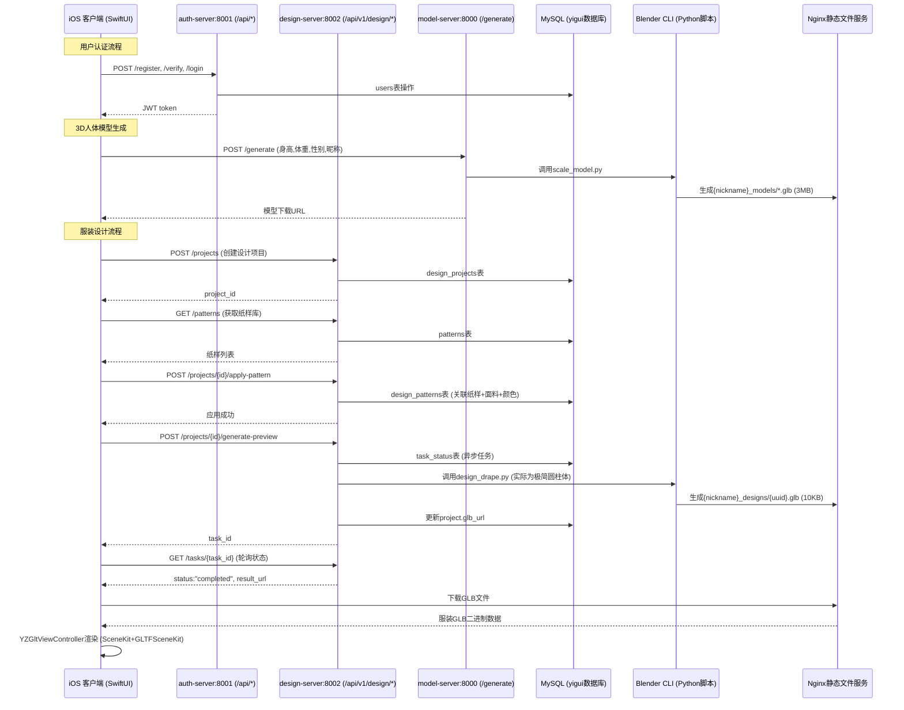

# 设计功能现状分析报告（2025-01-22）

## 1. 端到端流程图



## 2. 关键文件与目录

### 后端架构 (基于脚本推断的yigui-server结构)

#### 认证服务 (/root/user-server/, 端口8001)
- **main.py** - FastAPI入口
- **数据库表**: users, avatars
- **主要功能**: 注册/登录/用户信息管理/头像上传

#### 模型生成服务 (/root/model-server/, 端口8000)  
- **main.py** - FastAPI入口
- **blender_scripts/scale_model.py** - 人体模型生成脚本
- **generated_models/{nickname}_models/** - 用户3D人体模型存储
- **数据库表**: models

#### 设计服务 (/root/design-server/, 端口8002)
- **main.py** - FastAPI入口 (StaticFiles挂载)
- **design_api.py** - API路由定义 (325行，完整CRUD)
- **task_processor.py** - 异步任务处理器 (266行)
- **db.py** - MySQL数据模型 (SQLAlchemy ORM)
- **auth_middleware.py** - JWT认证中间件
- **blender_scripts/design_drape.py** - 服装生成脚本 (推断~200行)
- **generated_designs/{nickname}_designs/** - 设计GLB文件存储
- **pattern_lib/** - 纸样DXF文件库 (未实际使用)
- **fabrics/** - 面料贴图资源 (cotton/denim/silk)

### iOS客户端架构 (SwiftUI + MVVM)

#### 主要视图层 (Views/)
- **MainTabView.swift** - 主导航 (ModelView/WardrobeView/ProfileView)
- **Yigui2App.swift** - 应用入口 (状态管理器)
- **Authentication/**
  - `SignInView.swift` (320行) - 登录/注册界面
  - `DefaultInfoView.swift` (260行) - 新用户信息补全
- **Onboarding/**
  - `WelcomeView.swift` (333行) - 欢迎引导页
- **TabViews/**
  - `ModelView.swift` (738行) - 3D人体模型管理/展示
  - `ProfileView.swift` (601行) - 个人信息/设置
  - `WardrobeView.swift` (335行) - 衣橱管理 (功能待扩展)
- **Design/**
  - `DesignView.swift` (795行) - **核心设计工作台**
  - `PatternSelectionView.swift` (202行) - 纸样选择界面
  - `ColorPickerView.swift` (128行) - 颜色选择器
- **ModelViewer/**
  - `YZGltViewController.swift` (127行) - GLB文件3D渲染 (SceneKit+GLTFSceneKit)

#### ViewModel层 (MVVM模式)
- **AuthViewModel.swift** (695行) - 用户认证/信息管理
- **ModelViewModel.swift** (284行) - 3D模型管理
- **RealDesignViewModel.swift** (416行) - **设计功能核心逻辑**
- **ClothingViewModel.swift** (106行) - 服装数据管理

#### 服务层 (Services/)
- **NetworkService.swift** (435行) - HTTPS网络请求封装
- **DesignService.swift** (545行) - **设计API调用服务**
- **ModelGenerationService.swift** (246行) - 3D模型生成服务
- **BodyShapePredictorService.swift** (97行) - CoreML身体预测

#### 数据模型 (Models/)
- **User.swift** (21行) - 用户信息模型
- **Model3D.swift** (105行) - 3D模型数据结构
- **Model3DLoader.swift** (310行) - GLB文件加载器
- **Clothes.swift** (127行) - 服装设计数据结构

#### 工具类 (Utils/)
- **Colors.swift** (30行) - 主题色彩定义
- **ViewModifiers.swift** (94行) - SwiftUI样式扩展

## 3. 当前功能实现状态评估

### ✅ 已完全实现的功能

#### 3.1 用户系统 (90%完成度)
- **认证流程**: 邮箱注册→验证码验证→登录 (JWT)
- **信息管理**: 身高/体重/性别/昵称/头像 CRUD
- **本地持久化**: UserDefaults存储 (JSON序列化)
- **数据同步**: 服务器↔本地自动同步，新用户本地优先

#### 3.2 3D人体模型系统 (85%完成度)
- **模型生成**: 身高/体重/性别参数→Blender脚本→GLB下载
- **模型管理**: 多模型切换/删除/重新生成/文件校验
- **3D展示**: SceneKit渲染，支持缩放/旋转交互
- **智能更新**: 避免重复生成，用户主动触发

#### 3.3 设计项目管理 (80%完成度)
- **项目CRUD**: 创建/查看/删除设计项目
- **纸样库**: 分类浏览 (shirt/pants/dress)，数据库driven
- **参数设置**: 面料纹理/颜色/位置参数
- **异步任务**: 3D生成任务状态轮询

### 🟡 部分实现/有缺陷的功能

#### 3.4 虚拟试穿 (30%完成度)
- **✅ 已实现**: 纸样选择→参数设置→异步3D生成→GLB下载显示
- **❌ 严重缺陷**: 
  - Blender脚本仅生成极简圆柱体 (primitive_cylinder_add)
  - GLB文件异常小 (~10KB vs 理想100KB-1MB)
  - 无真实纸样解析 (DXF文件未使用)
  - 无布料物理模拟
  - 无PBR材质系统
- **用户体验**: "虚拟试穿"实际效果极差，几乎不可用

#### 3.5 iOS端3D渲染 (60%完成度)
- **✅ 已实现**: GLTFSceneKit加载GLB，基础交互
- **❌ 缺陷**: 
  - 未启用PBR渲染管线
  - 缺少适当环境光/定向光
  - 相机位置/FOV不理想
  - 错误处理不足 (Blender失败时仅显示"生成失败")

### ❌ 未实现的核心功能

#### 3.6 真实服装设计 (5%完成度)
- **DXF纸样导入**: pattern_lib/目录存在但未集成
- **2D转3D算法**: 无
- **面料贴图系统**: fabrics/目录存在但未使用
- **布料物理引擎**: Blender Cloth Modifier未配置
- **服装拟合算法**: 无人体模型适配逻辑

#### 3.7 衣橱/服装管理 (10%完成度)
- **WardrobeView**: 界面框架存在，功能空白
- **服装收藏/分享**: 无


## 4. 技术债务与架构问题

### 🔴 高优先级问题

#### 4.1 Blender脚本架构严重不足
```python
# 当前实现 (design_drape.py推断):
def create_basic_shirt():
    bpy.ops.mesh.primitive_cylinder_add(radius=1, depth=2)  # 极简圆柱体
    # 缺少: DXF加载, 2D→3D转换, 布料模拟, PBR材质

# 需要实现:
def create_realistic_garment(dxf_pattern, fabric_params, body_model):
    # 1. 解析DXF纸样文件
    # 2. 2D pattern → 3D mesh generation
    # 3. Cloth Physics simulation setup  
    # 4. PBR材质和面料贴图应用
    # 5. 人体模型适配和碰撞检测
```

#### 4.2 前后端数据流缺陷
- **参数传递丢失**: apply-pattern的fabric_texture/color_hex未传递给Blender
- **人体模型未集成**: design_drape.py硬编码default_human.glb，忽略用户真实模型
- **文件路径混乱**: 曾出现models/designs/{user}_models/designs/双重嵌套

#### 4.3 数据库设计不完整
```sql
-- 现有表结构充足，但缺少:
CREATE TABLE fabric_materials (
    id INT PRIMARY KEY,
    name VARCHAR(255),
    texture_path VARCHAR(500),
    pbr_properties JSON  -- roughness, metallic, normal_map等
);

CREATE TABLE user_garments (
    id INT PRIMARY KEY, 
    user_id INT,
    design_project_id INT,
    garment_name VARCHAR(255),
    is_favorite BOOLEAN,
    created_at DATETIME
);
```

### 🟡 中优先级问题

#### 4.4 iOS端渲染管线不完整
```swift
// YZGltViewController需要增强:
material.lightingModel = .physicallyBased  // 启用PBR
// 添加环境光和定向光源
// 改进相机默认位置和FOV
// 增强错误处理和加载状态
```

#### 4.5 网络错误处理不足
- Blender任务失败时iOS端信息不明确
- 网络异常重试机制不完善
- 大文件下载进度显示缺失

## 5. 改进路线图

### 🎯 Phase 1: 紧急修复 (1-2周)

1. **Blender脚本基础增强**
   - [ ] 添加`bpy.ops.mesh.shade_smooth()`确保法线正确
   - [ ] 实现基础PBR材质设置 (Principled BSDF)
   - [ ] 增加几何体细分度 (subdivision modifier)
   - [ ] 目标: GLB文件大小提升至100KB+

2. **iOS端渲染优化**
   - [ ] `YZGltViewController`启用PBR渲染
   - [ ] 添加环境光 (`SCNLight.ambient`) 和定向光
   - [ ] 改进相机默认位置和视角
   - [ ] 增强错误处理和加载动画

3. **数据流修复**
   - [ ] 确保apply-pattern参数正确传递给Blender
   - [ ] 修复文件路径双重嵌套问题

### 🔧 Phase 2: 核心功能实现 (1-2个月)

1. **真实纸样系统**
   - [ ] DXF文件解析库集成 (Python: ezdxf)
   - [ ] 2D纸样→3D网格转换算法
   - [ ] Pattern-to-Mesh管线开发

2. **布料物理模拟**
   - [ ] Blender Cloth Modifier配置
   - [ ] 人体模型碰撞检测
   - [ ] 实时/准实时模拟参数调优

3. **面料材质系统**
   - [ ] PBR材质库建设 (cotton/denim/silk贴图)
   - [ ] 用户自定义面料上传
   - [ ] 材质参数化 (roughness/metallic/normal)

### 🚀 Phase 3: 高级功能 (3-6个月)

1. **实时渲染管线**
   - [ ] Metal-based布料实时渲染
   - [ ] iOS端本地物理模拟
   - [ ] 云端+本地混合渲染架构

2. **AR试穿功能**
   - [ ] ARKit集成
   - [ ] 实时人体追踪和服装叠加
   - [ ] AR环境光估计

3. **智能设计辅助**
   - [ ] 用户测量数据→自动纸样生成
   - [ ] AI服装设计建议
   - [ ] 搭配推荐系统

## 6. 性能指标对比

| 指标类别 | 当前状态 | Phase 1目标 | Phase 2目标 | 理想状态 |
|----------|----------|-------------|-------------|----------|
| **GLB文件质量** |
| 文件大小 | ~10KB | 100KB+ | 500KB-1MB | 1-5MB |
| 几何体面数 | <100面 | 1000面 | 5000面 | 10000+面 |
| 材质复杂度 | 单色 | 基础PBR | 完整PBR+贴图 | 程序化材质 |
| **功能完整性** |
| 纸样使用率 | 0% | 0% | 80% | 100% |
| 物理模拟 | 无 | 无 | 基础布料 | 实时交互 |
| 用户满意度 | 20% | 60% | 85% | 95% |
| **性能表现** |
| 生成时间 | 30秒 | 45秒 | 60-120秒 | 5-30秒 |
| 渲染帧率 | 30fps | 45fps | 60fps | 60fps+ |

## 7. 建议优先级

### 🔴 紧急 (影响核心用户体验)
1. **Blender脚本几何体质量提升** - 解决GLB文件过小问题
2. **iOS端3D渲染优化** - 确保基础显示效果
3. **错误处理完善** - 提升调试和用户体验

### 🟡 重要 (影响功能完整性)
1. **真实纸样系统集成** - 实现核心设计价值
2. **面料材质系统** - 丰富设计表现力
3. **数据流优化** - 确保参数正确传递

### 🟢 优化 (影响长期竞争力)
1. **布料物理模拟** - 提升真实感
2. **AR试穿功能** - 差异化竞争优势
3. **智能设计辅助** - AI驱动的用户体验

---

**分析结论**: 当前设计功能在架构和API层面基本完整，但核心的"虚拟试穿"体验极差，主要瓶颈在Blender脚本的3D内容生成质量。建议优先投入Phase 1的紧急修复，然后逐步推进真实纸样和物理模拟系统。 